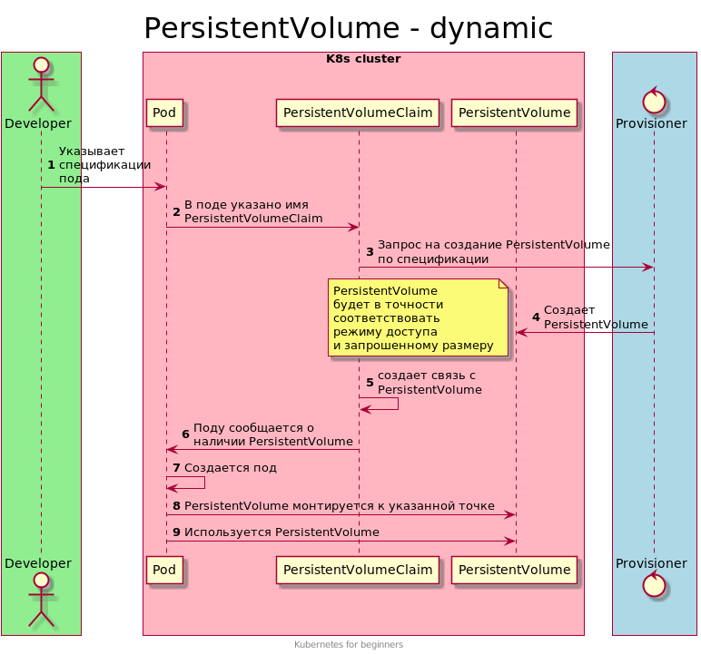

# Динамическое выделение томов
[Документация](https://kubernetes.io/docs/concepts/storage/dynamic-provisioning/)

Создание PersistentVolume силами админа не самое лучшее решение.
Есть решение лучше - динамическое выделение томов.

Тома выделяются автоматически и эти тома соответствуют тем параметрам, которые требуются.

## Схема работы
В новой схеме работы исключена рутинная работа админа.
 
  

## Подключение и отключение provisioner
Для динамического выделения томов необходимо подключить один или больше `provisioner`.

Косвенным признаком наличия `provisioner` Является наличие StorageClass. StorageClass мы рассмотрим чуть ниже.

```shell script
# Посмотреть список StorageClass
kubectl get storageclasses.storage.k8s.io

# Посмотреть список StorageClass (короткое имя)
kubectl get sc

# Показывает ноды, к которым могут быть примонтированы тома
kubectl get csinodes

# CSIDriver 
kubectl get csidrivers
```

Если StorageClass нет, то и `provisioner` тоже нет. Необходимо произвести его установку.

### Minikube
```shell script
minikube addons list
minikube enable storage-provisioner
minikube disable storage-provisioner
```

### Microk8s
```shell script
microk8s status
microk8s enable storage
microk8s disable storage
```

### NFS
```shell script
# Установка helm 
curl https://raw.githubusercontent.com/helm/helm/master/scripts/get-helm-3 | bash

# Добавление репозитория чартов 
helm repo add stable https://charts.helm.sh/stable && helm repo update

# Установка nfs-server через helm 
helm install nfs-server stable/nfs-server-provisioner

# В дальнейшем при создании PVC, на подах может возникнуть следующая проблема (поды завистун в статусе ContainerCreating):
Output: mount: /var/lib/kubelet/pods/f760c19e-6ec0-46e8-9a3a-d6187fd927e8/volumes/kubernetes.io~nfs/pvc-d3134d79-c2ce-41a2-af72-0f2d45c5c19e:
bad option; for several filesystems (e.g. nfs, cifs) you might need a /sbin/mount.<type> helper program.

# Решение проблемы (необходимо установить на всех нодах !!!):
sudo apt install nfs-common - для debian/ubuntu
```

## Демо
Для удобства откроем еще одно окно терминала. Это позволит наблюдать за происходящим.
```shell script
watch 'kubectl get po,pvc,pv'
```

```shell script
kubectl apply -f templates/10-pod.yaml
kubectl apply -f templates/20-pvc.yaml
```
После этого будет создан PersistentVolume.
Создана связка PersistentVolumeClaim-PersistentVolume.
И запущен Pod.

```shell script
kubectl exec pod -- ls -la /static
kubectl exec pod -- sh -c "echo 'dynamic' > /static/dynamic.txt"

# Определим в какой папке у нас хранятся данные
kubectl get pv -o yaml | grep '^\s*path:'

# На ноде ищем файл. Например
sudo ls -la /var/snap/microk8s/common/default-storage/default-pvc-pvc-7bd66d4c-189e-44d1-ad0f-bc091491525e
```

Все работает как ожидалось.

## Удаление ненужного тома
В случае динамического создания томов их имена будут содержать uid PersistentVolumeClaim, который явился причиной создания PersistentVolume.

```shell script
# uid PVC
kubectl get pvc pvc -o yaml | grep uid

# название PV, связанного с данным PVC 
kubectl get pvc pvc -o yaml | grep '^\s*volumeName'

# Удаление pvc
kubectl delete pod pod
kubectl delete pvc pvc
```

После удаления пода и PersistentVolumeClaim будет удален и PersistentVolume.
Все данные тоже будут удалены. Так как они больше не нужны.

## StorageClass
[Документация](https://kubernetes.io/docs/concepts/storage/storage-classes/)

StorageClass - это объект, который определяет параметры подключенного тома.
StorageClass указывается явно или неявно в спецификации PersistentVolumeClaim

```shell script
# Посмотреть список StorageClass
kubectl get storageclasses.storage.k8s.io

# Посмотреть список StorageClass (короткое имя)
kubectl get sc
```

Предположим, что вам нужно задать поведение, которое является нестандартным для данного `provisioner`.
Сделать это можно с помощью создание своего StorageClass.

```yaml
apiVersion: storage.k8s.io/v1
kind: StorageClass
metadata:
  name: my-nfs
provisioner: example.com/external-nfs
parameters:
  server: nfs-server.example.com
  path: /share
  readOnly: "false"
```

Укажите в PersistentVolumeClaim новый StorageClass. 

```yaml
apiVersion: v1
kind: PersistentVolumeClaim
metadata:
  name: pvc
spec:
  storageClassName: my-nfs
  accessModes:
    - ReadWriteOnce
  resources:
    requests:
      storage: 2Gi
```
